> `ros2can` のマニュアルです。`xiao_esp32_s3_smd_serial_bridge`（MODE_CAN_HOST）
> 専用のスタンドアローンGUIで、シリアルポートのスキャン・専有・serial_bridge
> 互換フレームの送受信を自前で行います。
>
> **初めての方は [クイックスタート](quickstart.md) から読むのがおすすめです。**

## 目次

- [1. 概要](#1-概要)
  - [1.1 serial_bridgeとの比較](#11-serial_bridgeとの比較)
- [2. システム要件](#2-システム要件)
- [3. インストールと起動](#3-インストールと起動)
  - [3.1 serial_bridge との併用について](#31-serial_bridge-との併用について)
- [4. 起動直後の画面](#4-起動直後の画面)
- [5. デバッグモード（実機不要でのUI確認）](#5-デバッグモード実機不要でのui確認)
- [6. 画面構成](#6-画面構成)
  - [6.1 Control タブ（指令送信）](#61-control-タブ指令送信)
  - [6.2 Monitor タブ（センサ受信）](#62-monitor-タブセンサ受信)
  - [6.3 Raw タブ（全24スロット）](#63-raw-タブ全24スロット)
  - [6.4 Info タブ](#64-info-タブ)
- [7. 外部ノードとの接続](#7-外部ノードとの接続)
- [8. プロファイル](#8-プロファイル)
- [9. CubeMars AKシリーズ（MODE_CUBEMARS）](#9-cubemars-akシリーズmode_cubemars)
- [10. DJIロボマス（MODE_ROBOMAS）](#10-djiロボマスmode_robomas)
- [11. ファームウェア生成・書き込み](#11-ファームウェア生成書き込み)
- [12. 設定](#12-設定)
- [13. エンコーダ初期化](#13-エンコーダ初期化)
- [14. 安全機能について](#14-安全機能について)
- [15. About](#15-about)

---

## 1. 概要

`ros2can` は、CANバス経由で複数マイコンをホストする `xiao_esp32_s3_smd_serial_bridge`
（MODE_CAN_HOST）専用の ROS 2 GUI パッケージです。

この基板は USB シリアルでつながる「CANホスト」で、自身の配下に CAN バス経由で
最大4台の子マイコン（ノード）をデイジーチェーン接続可能です。`ros2can` はホストの
シリアルポートを直接掴み、バス上の各ノードへアクチュエータ指令を直接送信したり、
センサ値をリアルタイムに表示することができます。また、`serial_bridge` と同様に
トピックを用いた外部ノードとの接続も可能です。

```
  [ros2can (GUI, スタンドアローン)]
       │
       ├─ port_scanner ─── /dev/ttyUSB*, /dev/ttyACM* を探索
       │
       └─ USBシリアル ──► CANホスト (MODE_CAN_HOST)
                             │
                             └─ CANバス
                                  ├─ ノード1 (CAN_ID=101)
                                  ├─ ノード2 (CAN_ID=102)
                                  ├─ ノード3 (CAN_ID=103)
                                  └─ ノード4 (CAN_ID=104)
```

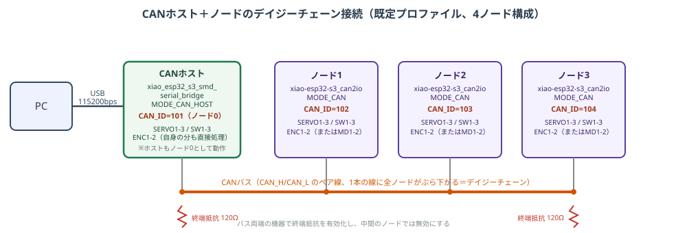

上図はUSB接続からCANバスの物理的なつながり方（デイジーチェーン、バス両端の終端抵抗）
までを示したイメージです。ホスト自身も「ノード0」として自分のI/Oを直接処理する点に
注意してください。各ノードの SERVO/SW、ENC/MD が具体的にどう配線されるかは
[8. プロファイル](#8-プロファイル) の対応スロットマッピング図を参照してください。

ホストのUSBシリアル側は常に `serial_bridge` 互換の24 x int16スロット
（TX: ROS→ホスト、RX: ホスト→ROS）を1フレームとしてやり取りします。この24スロットを
CANバス上の各ノードへどう割り当てるかを決めるのが後述の「[8. プロファイル](#8-プロファイル)」です。

`xiao-esp32-s3_can2io` ファームウェア自体は、ノードを束ねる「CANホスト」以外にも、
CANバスに直接ぶら下がる独立デバイスとしていくつかのモードを持っています。

| ファームウェア MODE | 役割 | 対応するros2canプロファイル |
|:---|:---|:---|
| `MODE_CAN_HOST` | 複数ノードを束ねるCANホスト本体（本マニュアルの主対象） | XIAO ESP32S3 SMD/MES/SS (CAN Host) |
| `MODE_CAN` | ホスト配下の汎用IOノード（通常の子マイコン） | （CAN Host側のプロファイルに内包） |
| `MODE_ROBOMAS` | DJIロボマス最大4台を直接駆動する独立デバイス | [xiao-esp32-s3_can2io (MODE_ROBOMAS, DJIロボマス x4)](#10-djiロボマスmode_robomas) |
| `MODE_CUBEMARS` | CubeMars AKシリーズ最大4台を直接駆動する独立デバイス | [xiao-esp32-s3_can2io (MODE_CUBEMARS, CubeMars AKシリーズ x4)](#9-cubemars-akシリーズmode_cubemars) |
| `MODE_IO` | CAN無し、IOのみのスタンドアロン動作 | 汎用 Raw 等 |
| `MODE_CAN_MONITOR` | 生CANフレームをシリアル出力するだけの診断用モード | （ros2canのデバイス一覧には出ない。「CANモニター…」参照） |
| `MODE_DEBUG` | デバッグ用 | - |

`MODE_ROBOMAS` / `MODE_CUBEMARS` は「CANホストにぶら下がるノード」ではなく、
それ自体が独立したCANデバイスとして動作します（ホストを介さずCANバスへ
直接接続）。ros2can上ではそれぞれ専用のプロファイルを選ぶことで、通常の
CANホスト機と同じ画面（Control/Monitor/Raw/Info）から操作できます。

### 1.1 serial_bridgeとの比較

`ros2can` は `serial_bridge` の後継として、CANバス化による配線の簡素化と、
GUIによる操作性の向上を主な目的に開発されました。

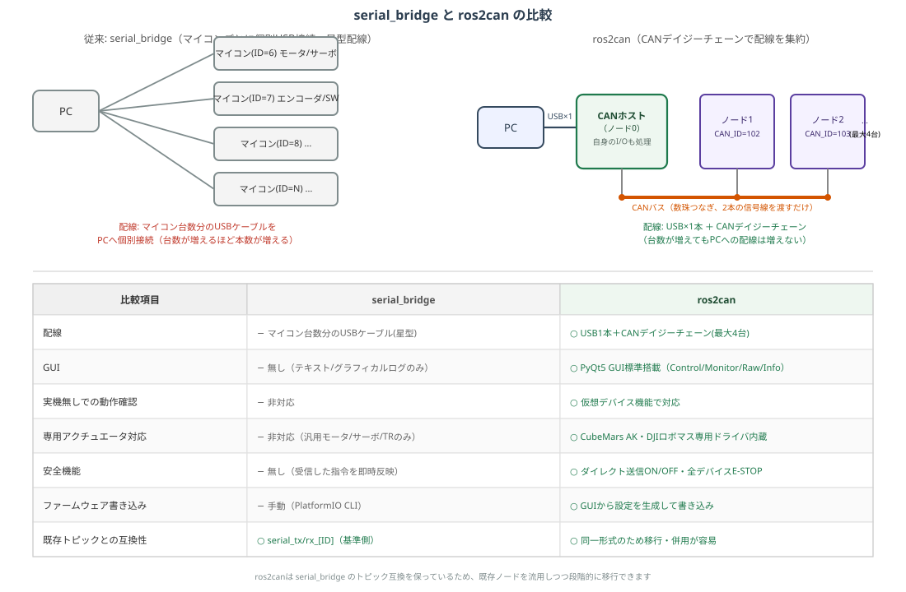

- **配線**: `serial_bridge` はマイコン1台につきUSBケーブル1本をPCへ個別接続する
  星型配線のため、台数が増えるほど配線本数・USBポート数が増えます。`ros2can` は
  PCとの接続をCANホスト1台分（USB1本）に集約し、残りはCANバスでの数珠つなぎ
  （デイジーチェーン）で済むため、台数が増えてもPC側の配線は増えません。
- **GUI**: `serial_bridge` はログ出力（テキスト/グラフィカル/サイレント）のみで、
  指令送信やパラメータ確認はコマンドラインや別ツールが必要です。`ros2can` は
  PyQt5 GUIを標準搭載し、Control/Monitor/Raw/Infoの各タブから直感的に操作できます。
- **実機不要の動作確認**: `ros2can` の仮想デバイス機能（[5. デバッグモード](#5-デバッグモード実機不要でのui確認)）
  により、実機が無くてもUIやトピック連携をその場で確認できます。
- **専用アクチュエータ対応**: CubeMars AKシリーズ・DJIロボマス用の専用ドライバ
  （MITモード等）を内蔵しており、`serial_bridge` の汎用モータ/サーボ/TR出力より
  高度な制御にそのまま対応します。
- **安全機能**: ダイレクト送信の既定OFFや全デバイスE-STOPなど、誤操作を防ぐ仕組みが
  GUI側に組み込まれています。
- **移行のしやすさ**: `serial_tx_[ID]`/`serial_rx_[ID]` のトピック形式は
  `serial_bridge` と同一のため、既存ノードをそのまま流用しつつ段階的に移行・併用
  できます（併用時の設定は [3.1 serial_bridgeとの併用について](#31-serial_bridge-との併用について) 参照）。

## 2. システム要件

| 項目 | 内容 |
|:---|:---|
| OS | Ubuntu 24.04 LTS |
| ROS | ROS 2 Jazzy |
| GUI | PyQt5 |
| ボーレート | 115200 bps |
| ハードウェア | `xiao_esp32_s3_smd_serial_bridge`（MODE_CAN_HOST）を書き込んだ基板を USB 接続 |
| 追加パッケージ | `python3-pyqt5`, `python3-serial` |

> `/dev/ttyUSB*` や `/dev/ttyACM*` を使用するには `dialout` グループへの追加が必要です。
> `sudo usermod -aG dialout $USER`（反映には再ログインが必要）

## 3. インストールと起動

```bash
cd ~/ros2_ws
colcon build --packages-select ros2can
source install/setup.bash
```

起動（`config/ros2can.yaml` のパラメータを読み込む場合は launch を使用）:

```bash
ros2 run ros2can ros2can
# または
ros2 launch ros2can ros2can.launch.py
```

起動すると `ros2can` 自身がバックグラウンドスレッドで `/dev/ttyUSB*` /
`/dev/ttyACM*` を定期的にスキャンし、CANホストを検出すると自動的に
シリアルポートを専有してデバイス一覧に表示します。

### 3.1 serial_bridge との併用について

同一マシンで `serial_bridge` を併用することも可能です（移行期間中、他のマイコンは
serial_bridge、CANホストは ros2can、といった構成）。`ros2can` はポートを開いた直後に
`ioctl(fd, TIOCEXCL)` を発行してポートを排他専有するため、**ros2can が先にポートを
掴んでいれば** serial_bridge 側の `open()` が失敗して静かにリトライされるだけで済み、
フレームの競合は起きません。ただし逆方向（serial_bridge が先にポートを掴んだ場合）は
serial_bridge 側にも同様の排他制御が無いと完全には防げません。既知の対策:

- `config/ros2can.yaml` の `excluded_ports` に serial_bridge 管理下のポートを
  列挙し、ros2can 側のスキャン対象から外す。
- 同様に `serial_bridge.yaml` の `excluded_ports` に ros2can 管理下のポートを
  列挙する。

## 4. 起動直後の画面

マイコン未接続の状態では、下図のようなプレースホルダー画面が表示され、
接続手順やトラブルシューティングの案内が表示されます。

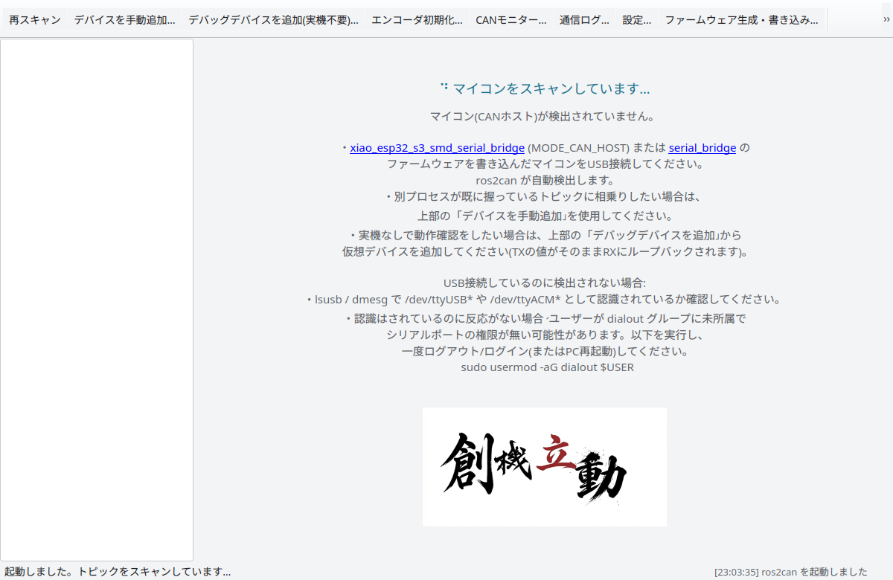

ツールバーの各ボタンから、以下の操作ができます。

| ボタン | 用途 |
|:---|:---|
| 再スキャン | ポートを即座に再スキャンする |
| デバイスを手動追加… | 既存トピックへ相乗りする形でデバイスを事前登録する |
| デバッグデバイスを追加（実機不要）… | 実機なしで動作確認できる仮想デバイスを追加する |
| エンコーダ初期化… | 全デバイス横断でエンコーダ/位置カウンタの原点セットを行う |
| CANモニター… | `MODE_CAN_MONITOR` 機の生CANフレームを直接閲覧する |
| 通信ログ… | 接続/切断やフレーム異常の履歴を確認する |
| 設定… | ハードウェアスキャンの挙動（除外ポート等）を編集する |
| ファームウェア生成・書き込み… | パラメータを反映したファームウェアを生成し、実機に書き込む |
| ■ 全デバイス E-STOP | 全接続デバイスへゼロ指令を送信し、送信を無効化する（緊急時に押す） |

## 5. デバッグモード（実機不要でのUI確認）

マイコン実機が手元に無くても、UIのレイアウト調整やウィジェットの動作確認が
できるよう、ツールバーの「デバッグデバイスを追加（実機不要）…」から**仮想デバイス**
を追加できます。DEVICE_ID を入力するだけで、その場で仮想デバイスが一覧に追加されます。

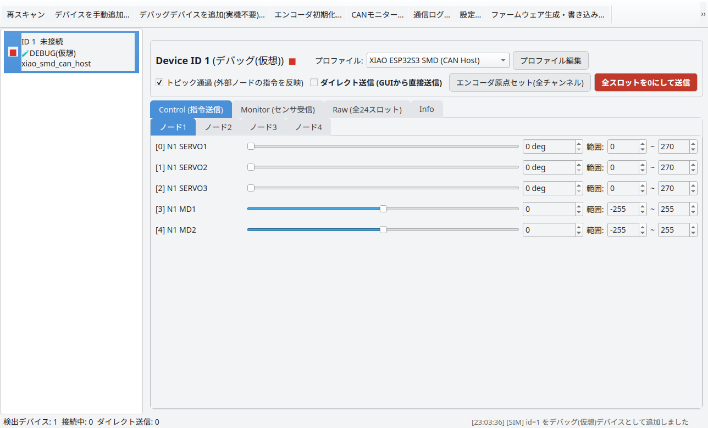

- Control タブでスライダー等を動かすと、書き込んだ値が仮想デバイスのRXに反映され、
  Monitor / Raw / Info タブにリアルタイムに表示されます（ただしスイッチ・エンコーダ・
  故障コード等、実機では指令と無関係な独立したセンサ入力に相当するRXは、この
  自動ループバックの対象外になります。詳細は [6.2 Monitor タブ](#62-monitor-タブセンサ受信) 参照）。
- 実機接続時と同じく `serial_rx_[ID]` を Publish / `serial_tx_[ID]` を Subscribe
  するため、rqt や他の ROS ノードからのテストにもそのまま使えます（[7. 外部ノードとの接続](#7-外部ノードとの接続) 参照）。
- デバイス一覧でデバイスを右クリックすると「このデバイスを削除」で取り除けます。
- デバッグデバイス追加時にプロファイルを指定すれば、CubeMars / ロボマス構成の
  UIもハードウェアなしでそのまま確認できます（本マニュアルの画面キャプチャも
  すべてこのデバッグモードで取得しています）。

## 6. 画面構成

デバイスを選択すると、右側に **Control / Monitor / Raw / Info** の4タブから
なるデバイスパネルが表示されます。CANホスト系プロファイル（ノード構成を持つもの）
ではさらにノード1〜4のサブタブに分かれますが、CubeMars/ロボマスのように
「ノード分配を行わない独立デバイス」のプロファイルでは、モータ(M1〜M4)ごとに
グループ化された1画面になります。

### 6.1 Control タブ（指令送信）

アクチュエータ（サーボ・モータ等）へ直接送信するタブです。送信には
「ダイレクト送信」チェック（既定OFF、誤操作防止）が必要です。「トピック通過」
（既定ON）をOFFにすると外部ノードからの `serial_tx_[ID]` を無視し、この
パネルの値のみが有効になります。

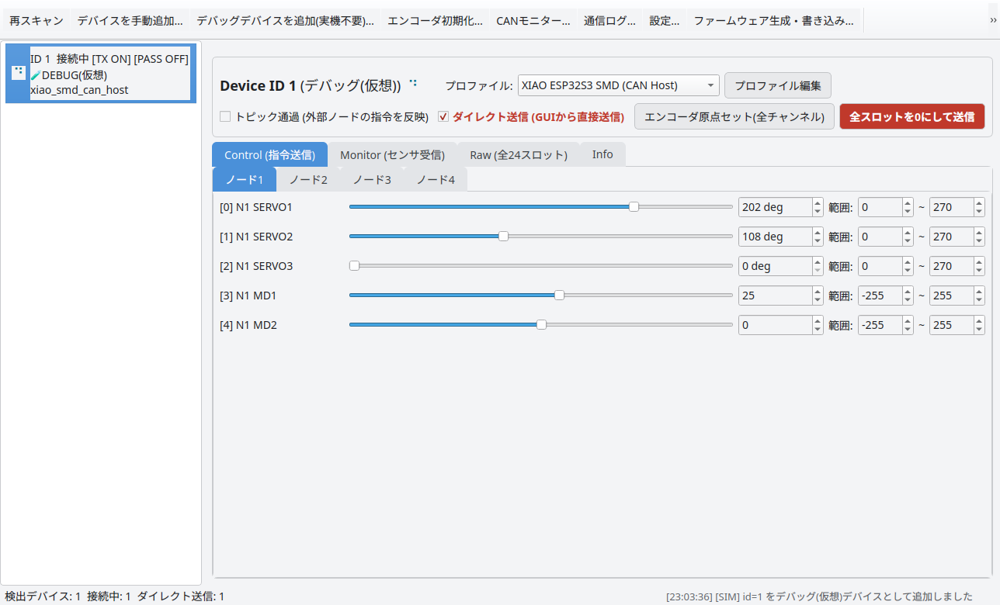

### 6.2 Monitor タブ（センサ受信）

センサ（スイッチ・エンコーダ等）の値をリアルタイム表示するタブです。

デバッグ（仮想）デバイスでは、RXチャンネルの種類によって挙動が異なります。

- **スイッチ・カウンタ・選択式入力**（ON/OFFスイッチ、エンコーダのカウント値、
  CubeMarsのエラーコード等）は、実機では指令(TX)と無関係な独立したセンサ入力に
  相当するため、この画面から**直接編集可能な行**として表示されます。ここで
  設定した値はTX→RXの自動ループバック対象から外れ、次に変更するまで保持されます。
- **数値表示のみのRX**（角度・速度・電流などのREADOUT系)は、Control タブで
  書き込んだTXの生値がそのままそのスロット番号のRXにループバックされ、
  読み取り専用で表示されます（後述のCubeMars/ロボマスのMonitorタブで見える
  数値は、対応するTXスロットの生値がそのまま流れ込んだものです）。

各チャンネルの「原点セット」ボタンで、その場の値をソフトウェア上のゼロ点として
記録できます（[13. エンコーダ初期化](#13-エンコーダ初期化) 参照）。

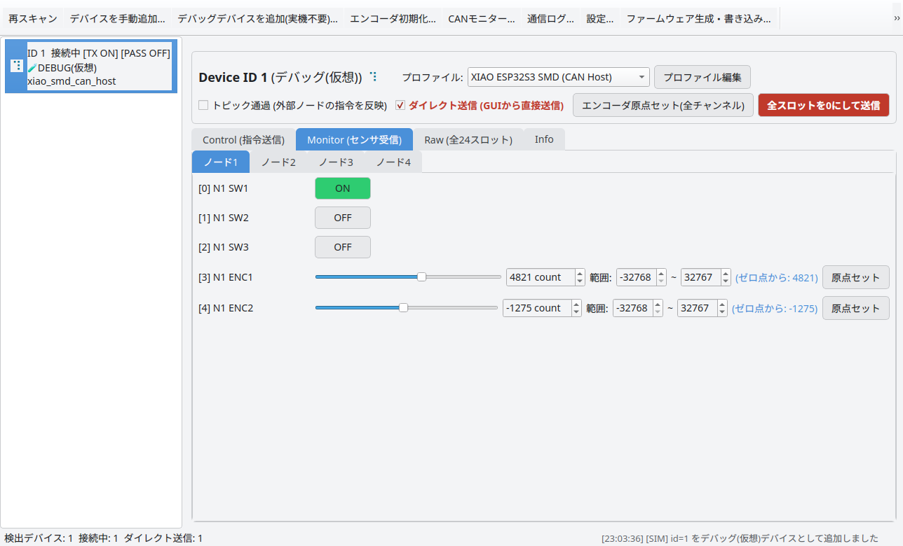

### 6.3 Raw タブ（全24スロット）

CAN分配を介さず、生の24 x int16スロットを直接編集/確認できます。
左がTX（ROS → ホスト → CAN、編集可能）、右がRX（CAN → ホスト → ROS、読み取り専用）です。
プロファイルの定義が想定通りか怪しいときや、未定義のプロファイル外スロットを
直接触りたいときに使用します。

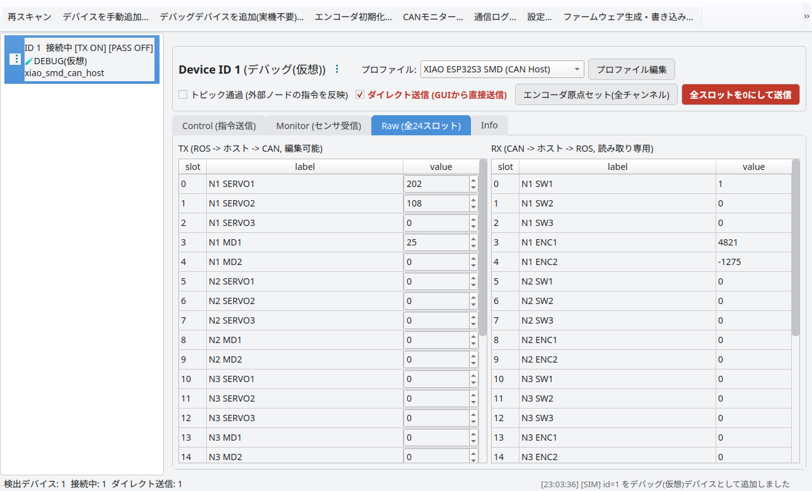

### 6.4 Info タブ

接続状態・RX周波数・送受信フレーム数・生データ配列を表示します。
通信の問題を切り分けたいときに参照してください。

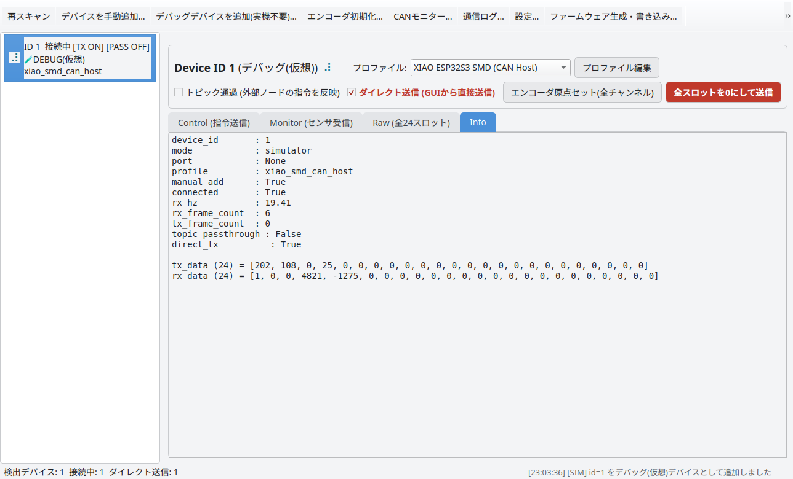

## 7. 外部ノードとの接続

`ros2can` は `serial_bridge` と同じトピックインターフェースを提供するため、
自作のROS 2ノードから指令送信・センサ受信を行えます。GUIの「ダイレクト送信」に
頼らず、常時ノードから自動制御したい場合はこの方法を使ってください。

### 7.1 トピック・サービス一覧

デバイスごとに `DEVICE_ID`（GUIのデバイス一覧やInfoタブで確認できます）に
対応した以下のトピック・サービスが生成されます。

**Subscribe トピック（ROS → CANホスト）**

| トピック | 型 | 説明 |
|:---|:---|:---|
| `serial_tx_[DEVICE_ID]` | `std_msgs/msg/Int16MultiArray` | CANホストへの制御指令（生の24スロット） |

**Publish トピック（CANホスト → ROS）**

| トピック | 型 | 説明 |
|:---|:---|:---|
| `serial_rx_[DEVICE_ID]` | `std_msgs/msg/Int16MultiArray` | センサ値（生の24スロット、`serial_bridge` 互換） |
| `serial_rx_[DEVICE_ID]_unwrapped` | `std_msgs/msg/Int32MultiArray` | エンコーダのオーバーフローを展開した積算値（実機接続時/デバッグデバイスのみ） |
| `serial_rx_[DEVICE_ID]_zeroed` | `std_msgs/msg/Int32MultiArray` | 上記から「原点セット」時点のオフセットを差し引いた相対値（同上） |

**Subscribe トピック（原点セット要求、ROS → CANホスト）**

| トピック | 型 | 説明 |
|:---|:---|:---|
| `zero_channel_request` | `std_msgs/msg/Int32MultiArray` | `data: [device_id, channel_index]` を送ると、指定デバイス・チャンネルの現在値を原点（0）としてソフトウェアオフセットを設定する。`channel_index<0` で全24チャンネル一括原点セット。成否は通信ログ（ツールバーの「通信ログ…」）に記録される（同期応答は無い） |

`serial_tx_[ID]`/`serial_rx_[ID]` は `serial_bridge` と同一の型・命名規則のため、
既存の `serial_bridge` 向けノードをほぼそのまま流用できます。

### 7.2 GUIとの関係（トピック通過 / ダイレクト送信）

自作ノードからの指令をデバイスに反映するには、対象デバイスの「トピック通過」
チェック（既定ON）が有効になっている必要があります。「ダイレクト送信」を
ONにするとGUIパネルの値が優先され、外部ノードからの `serial_tx_[ID]` は
無視されるので注意してください（両者は排他: [6.1 Control タブ](#61-control-タブ指令送信) 参照）。

ハードウェアがまだ接続されていない段階でも、ツールバーの「デバイスを手動追加…」
から `DEVICE_ID` を登録しておけば、`serial_tx_[ID]`/`serial_rx_[ID]` を
Publish/Subscribeするだけの「トピッククライアント」として先に動作確認できます
（[5. デバッグモード](#5-デバッグモード実機不要でのui確認) も参照）。

### 7.3 スロット割当ライブラリ（パケットコントローラ）

24スロットの生配列を直接インデックスで操作するとプロファイルとの対応が
崩れやすいため、`common/include/common/` にスロット割当を意識せず安全に
アクセスするためのラッパークラスが用意されています。

| ヘッダ | 対応プロファイル | 主なメソッド |
|:---|:---|:---|
| `Ros2CanPacketController.hpp` | 既定プロファイル `xiao_smd_can_host`（4ノード x 5スロット） | `setServo(node, servo_no, deg)` / `getSW(node, sw_no)` / `getEnc(node, enc_no)` |
| `Ros2CanCubemarsPacketController.hpp` | `cubemars_ak_driver`（MODE_CUBEMARS） | `setPosition(motor, deg)` / `setVelocity(motor, erpm)` / `setMit(motor, deg, ff, kp, kd, ff)` / `stop(motor)` / `stopAll()` / `getPosition`・`getVelocity`・`getCurrent`・`getTemperature`・`getError` |

いずれも送信配列 `tx_` / 受信配列 `rx_` を直接公開しているため、ラッパーに
無い操作は `operator[]` や `tx_`/`rx_` への直接アクセスで補えます。
`updateRx()` でSubscribeした `Int16MultiArray` の内容を反映し、`toVector()`
で送信用配列を取り出してそのまま `publish()` します。

> MODE_ROBOMAS（[10. DJIロボマス](#10-djiロボマスmode_robomas)）用の専用コントローラは
> 本リポジトリにはまだ実装がありません。[10.1節](#101-指令チャンネルcontrol-タブ)の
> スロット表に従って、生配列を直接操作してください。

### 7.4 サンプルパッケージ `ros2can_example`（C++、ビルド・実行可能）

`rrst-ros2-ws` ワークスペース直下に、外部ノードの最小構成を2つ収録した
`ros2can_example` パッケージがあります（`common`・`rclcpp`・`std_msgs` に
依存する `ament_cmake` パッケージ）。

> **配置場所についての注意**: `ros2can` リポジトリ自体はリポジトリ直下に
> `package.xml` を置く単一パッケージ構成のため、その配下に別パッケージを
> 置いてもcolconのデフォルト探索では見つかりません（既存パッケージの境界より
> 下は再帰探索されない仕様）。そのため `ros2can_example` は `ros2can`
> リポジトリの外、`rrst-ros2-ws` ワークスペース直下（`common`/`cr26_soki` と
> 同じ階層）に置かれています。素の `colcon build` でそのまま検出・ビルド
> されます。

| ノード | ソース | 内容 |
|:---|:---|:---|
| `servo_sweep_example` | [`ros2can_example/src/servo_sweep_example.cpp`](https://github.com/RRST-NHK-Project/rrst-ros2-ws/blob/develop/ros2can_example/src/servo_sweep_example.cpp) | 既定プロファイル (`xiao_smd_can_host`) 向け。ノード1(CAN_ID=101)のSERVO1を正弦波で往復させ、SW1/ENC1の帰還をログ出力する |
| `cubemars_position_example` | [`ros2can_example/src/cubemars_position_example.cpp`](https://github.com/RRST-NHK-Project/rrst-ros2-ws/blob/develop/ros2can_example/src/cubemars_position_example.cpp) | `cubemars_ak_driver` (MODE_CUBEMARS) 向け。モータ1(CAN_ID=101)を `setPosition()` で0〜90degの間で往復させ、位置・速度・電流・温度・エラーの帰還をログ出力する |

どちらもジョイスティック等の外部入力を必要とせず、実行するとその場で
動き出す自己完結型のサンプルです。骨格は共通で、`Ros2Can(Cubemars)PacketController`
を使って以下の3点だけを実装しています。

```cpp
// 1) ros2canへの指令をpublish
publisher_ = create_publisher<std_msgs::msg::Int16MultiArray>(
    "serial_tx_" + std::to_string(tx_device_id_), 10);

// 2) 一定周期でtx_をそのまま送り続ける
timer_ = create_wall_timer(std::chrono::milliseconds(PUBLISH_RATE_MS),
    std::bind(&MyNode::timer_callback, this));

// 3) ros2canからのセンサ値をsubscribeし、rx_を更新する
sensor_sub_ = create_subscription<std_msgs::msg::Int16MultiArray>(
    "serial_rx_" + std::to_string(rx_device_id_), 10,
    std::bind(&MyNode::sensor_callback, this, std::placeholders::_1));

// firmwareにCAN/シリアル途絶時のフェイルセーフは無く、最後に受信した指令を
// 保持し続ける。ノード終了時にゼロ指令を送るのはノード側の責務。
rclcpp::on_shutdown([this]() { send_zero_and_stop(); });
```

`cubemars_position_example` では `ctrlPkt_.setPosition(TARGET_MOTOR, target_deg)`
を毎周期呼ぶだけで、アクチュエータ内蔵のクローズドループが追従します。より
複雑な操作例（PS4ジョイスティックでのMIT(Force Control)モード制御、ボタンの
立ち上がりエッジ検出等）は、`cr26_soki` パッケージの
[`ros2can_practice.cpp`](https://github.com/RRST-NHK-Project/rrst-ros2-ws/blob/develop/cr26_soki/src/ros2can_practice.cpp)
を参照してください。

新しいノードを追加する場合は `ros2can_example/CMakeLists.txt` に
`add_executable`/`ament_target_dependencies`/`install(TARGETS ...)` を
1行ずつ追記すれば、この最小骨格をベースにそのまま増やせます。

#### ビルドと実行

```bash
cd ~/ros2_ws
colcon build --packages-select ros2can_example
source install/setup.bash

ros2 run ros2can_example servo_sweep_example
# または
ros2 run ros2can_example cubemars_position_example
```

対象デバイスは各ソース先頭の `TX_DEVICE_ID`/`RX_DEVICE_ID`/`TARGET_NODE`
(または `TARGET_MOTOR`) マクロで指定しています。実際のDEVICE_ID・ノード番号に
合わせて書き換えてから再ビルドしてください。動作確認には、実機の代わりに
[5. デバッグモード](#5-デバッグモード実機不要でのui確認) の仮想デバイスも使えます。

### 7.5 コマンドラインからの簡易テスト

ノードを書く前に、まずはCLIで疎通確認するのが手早い方法です。

```bash
# RXを購読して生の24スロットを流し見する
ros2 topic echo /serial_rx_1

# TXへ一度だけ24スロット(先頭=SERVO1のみ90、残り0)を送る例
ros2 topic pub --once /serial_tx_1 std_msgs/msg/Int16MultiArray \
  "{data: [90,0,0,0,0, 0,0,0,0,0, 0,0,0,0,0, 0,0,0,0,0, 0,0,0,0]}"

# デバイス1の全チャンネルを一括で原点セットする(channel_index<0で全チャンネル)
ros2 topic pub --once /zero_channel_request std_msgs/msg/Int32MultiArray \
  "{data: [1, -1]}"
```

`ros2 topic pub` は既定で周期送信になるため、1回だけ送りたい場合は
`--once` を付け忘れないよう注意してください（付け忘れると「ダイレクト送信」
無しでも指令が送られ続けます）。

## 8. プロファイル

「プロファイル」は、ホストのUARTフレーム24スロットをどう解釈するかを定義する
設定セットです。デバイスパネル上部の「プロファイル:」ドロップダウンから
デバイスごとに切り替えられます。組み込み(builtin)プロファイルは以下の通りです。

| プロファイルキー | 名前 | 概要 |
|:---|:---|:---|
| `xiao_smd_can_host` | XIAO ESP32S3 SMD (CAN Host) | 既定プロファイル。24スロットを4ノード x 5スロットに分配（SERVO1-3+MD1-2指令 / SW1-3+ENC1-2帰還）。SERVOn/SWn、ENCn/MDnはファームウェア側でピン共有 |
| `xiao_can2io_with_foc` | xiao-esp32-s3_can2io + b-g431-esc1_can2io (FOCモータ, robomas互換) | 2ノード構成のうち1ノードをFOCモータ(SimpleFOC、速度制御のみ)用チャンネルに置き換え |
| `xiao_mes_can_host` | XIAO ESP32S3 MES (CAN Host) | BOARD_MES用。各ノードMD1-2(指令)/SW1+ENC1-2+SW3(帰還)。ENC2とSW2/SW3はピン共有(ファーム側config.hppで排他固定) |
| `xiao_ss_can_host` | XIAO ESP32S3 SS (CAN Host) | BOARD_SS用。SERVO1-5+TR1-4(ソレノイドバルブ)の9指令チャンネルのため1ノード9スロットに拡張、24スロットの制約でノード数は既定2まで |
| `robomas_driver` | xiao-esp32-s3_can2io (MODE_ROBOMAS, DJIロボマス x4) | ノード分配なし。独立デバイスとしてDJIロボマス最大4台を直接制御。詳細は[10章](#10-djiロボマスmode_robomas) |
| `cubemars_ak_driver` | xiao-esp32-s3_can2io (MODE_CUBEMARS, CubeMars AKシリーズ x4) | ノード分配なし。独立デバイスとしてCubeMars AKシリーズ最大4台を直接制御。詳細は[9章](#9-cubemars-akシリーズmode_cubemars) |
| `generic_raw` | 汎用 Raw (24スロット、CAN分配なし) | ホストのUARTフレーム24スロットをそのまま直接編集/表示する |

ファームウェア側の `config.hpp` で `CAN_NODE_COUNT` / `CAN_SLOTS_PER_NODE`
（BOARD_VARIANTごとに値が異なる）を変更した場合や、独自のノード構成を
使う場合は、デバイスパネル右上の「プロファイル編集」からノード数・スロット数を
指定して雛形を自動生成し、ラベルやレンジを調整して保存してください。
カスタムプロファイルは `~/.config/ros2can/profiles/` にJSONとして保存され、
次回起動時にも読み込まれます（リポジトリ外のためGit管理対象にはなりません）。

### 対応スロットマッピング（既定プロファイル `xiao_smd_can_host`）

```
実機はDCモータ非搭載 (ENCx2, SWx3, SERVOx3のみ)。
1ノードあたり5スロット (CAN_SLOTS_PER_NODE=5):
  指令 (ROS -> ホスト -> CAN -> ノード): SERVO1, SERVO2, SERVO3, (予備, 予備)
  帰還 (ノード -> CAN -> ホスト -> ROS): SW1, SW2, SW3, ENC1, ENC2

SERVOn と SWn はピン共有 (ファームウェア config.hpp の MULTIn で切替、
0=スイッチ入力/1=サーボ出力)。ENCn と MDn もピン共有 (config.hpp の ENCn_MD で
切替、0=エンコーダ入力/1=MD(PWM+DIR)出力)。

グローバルスロット index = node_index(0-origin) * 5 + local_index
ノードの CAN_ID は 101,102,103,104 (下2桁 = ノード番号)
```

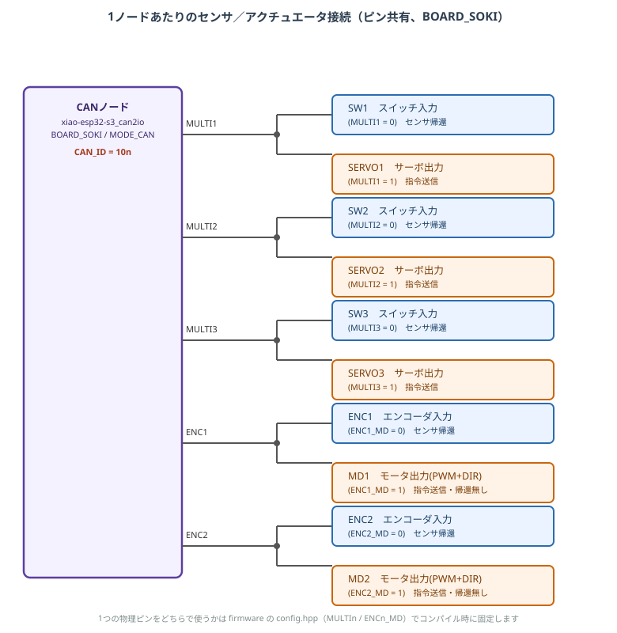

上図のように、1つの物理ピンをスイッチ入力/サーボ出力、あるいはエンコーダ入力/
モータ出力のどちらとして使うかは firmware の `config.hpp`（`MULTIn`/`ENCn_MD`）で
コンパイル時に固定します。実配線とこの設定が一致していないと、意図した
センサ/アクチュエータが正しく動作しません。

## 9. CubeMars AKシリーズ（MODE_CUBEMARS）

`cubemars_ak_driver` プロファイルは、CubeMars AKシリーズ（AK40-10等）の
アクチュエータ最大4台を、CANホストのノード分配を介さず直接制御するための
プロファイルです。ファームウェア側は `MODE_CUBEMARS` でビルドされた独立デバイスで、
各モータのCAN IDは `config.hpp` の `CUBEMARS_MOTOR_ID_n` でコンパイル時に固定します
（実機のR-Link設定と必ず一致させてください）。ノード分配を行わないため、スロット
0番起点でモータ1〜4の指令・帰還がそのまま並びます（`firmware/xiao-esp32-s3_can2io/src/cubemars.cpp`
のスロット割当と一致させること）。

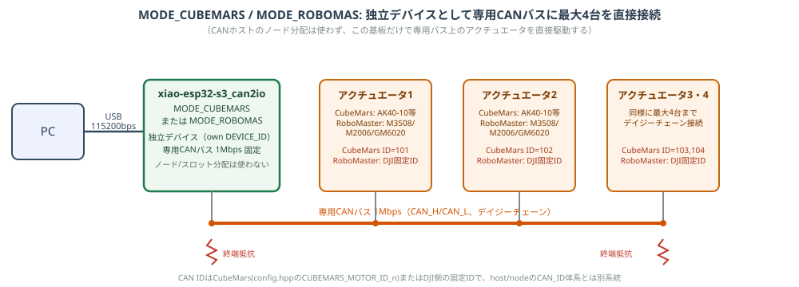

上図の通り、この基板はCANホストのノードとしてではなく、専用CANバス上に
アクチュエータを最大4台まで直接ぶら下げる独立デバイスとして動作します
（CAN_IDの体系もCANホスト/ノードとは別系統です）。

アクチュエータ自身が速度・位置のクローズドループを内蔵しているため、
ロボマス(GM6020)と異なりホスト側でのPID制御は行いません。3つの制御モードの
中でも特に**MITモードは、剛性(Kp)・減衰(Kd)をCAN経由でリアルタイムに変えられる
柔らかい位置制御**として非常に使い勝手が良く、外力を受け流したい機構や、
接触・衝突が想定される可動部との相性が良いモードです。詳しくは
[9.2 MITモードの活用](#92-mitモードの活用) を参照してください。

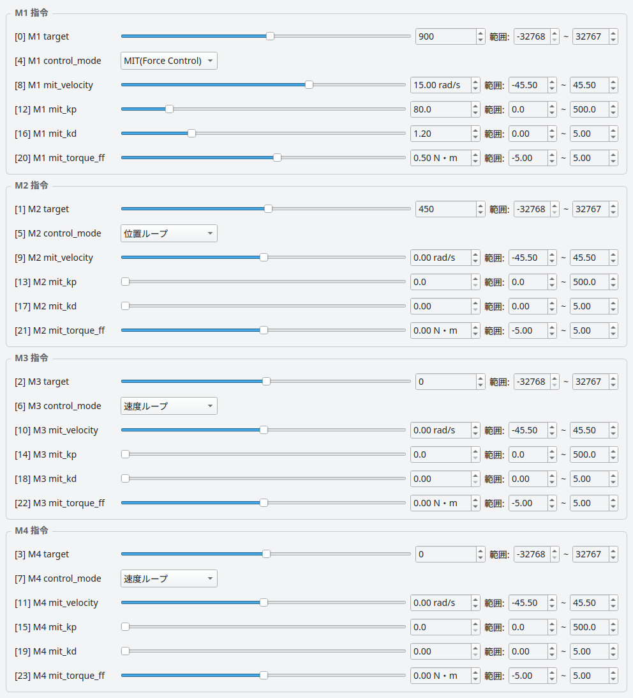

### 9.1 指令チャンネル（Control タブ）

モータごとに以下の6チャンネルがあります（`M{n}` の `n` は1〜4）。

| チャンネル | 種別 | 説明 |
|:---|:---|:---|
| `M{n} target` | 数値 | `control_mode` が速度ループのとき 10ERPM/LSB（電気角速度）、位置ループ/MITのとき 0.1deg/LSB。GUI上はスケール無しの生値として編集する |
| `M{n} control_mode` | 選択式 | `0`=速度ループ / `1`=位置ループ / `2`=MIT(Force Control)。全ゼロ（未接続・E-STOP時の既定）で速度ループ・target=0となり、位置ジャンプなく安全にその場停止する |
| `M{n} mit_velocity` | 数値 | MITモード用の目標速度（`control_mode=2`のときのみ参照）。0.01rad/s/LSB、レンジ±45.5rad/s |
| `M{n} mit_kp` | 数値 | MITモード用のKp（`control_mode=2`のときのみ参照）。0.1/LSB、レンジ0〜500 |
| `M{n} mit_kd` | 数値 | MITモード用のKd（`control_mode=2`のときのみ参照）。0.01/LSB、レンジ0〜5 |
| `M{n} mit_torque_ff` | 数値 | MITモード用のトルクフィードフォワード（`control_mode=2`のときのみ参照）。0.01N・m/LSB、レンジ±5.0N・m |

MITモードの詳しい解説・使い方・重要な角度制約は
[9.2 MITモードの活用](#92-mitモードの活用) にまとめています。

### 9.2 MITモードの活用

#### なぜMITモードが便利か

速度ループ・位置ループはアクチュエータ内蔵のクローズドループにそのまま
追従させるだけの「硬い」制御ですが、**MITモード**は位置・速度・Kp・Kd・
トルクFFを同時に指令し、モータ側で

```
torque = Kp * (pos_des - pos) + Kd * (vel_des - vel) + torque_ff
```

を計算するインピーダンス制御です（AK Series Module Product Manual V3.2.0
4.2節）。Kp/Kdという「バネ・ダンパ定数」をCAN経由で毎周期変更できるため、

- 剛性(Kp)を下げれば、外力を受けたときに柔らかく撓む・受け流す関節にできる
  （人や機構との接触が想定される可動部、指先・ハンド機構等に向く）
- Kp=0にしてtorque_ffだけ使えば、事実上のトルク制御（重力補償等）としても使える
- 同じハードウェアのまま、Kp/Kdの調整だけで「硬い位置決め」〜「柔らかい追従」
  まで挙動を連続的に変えられる（速度/位置ループへのモード切替が不要）

といった理由で、速度ループ・位置ループより柔軟で扱いやすいモードです。
迷ったら、まずMITモードをKp/Kd小さめから試すのがおすすめです。

`mit_velocity`/`mit_kp`/`mit_kd`/`mit_torque_ff` の各スロットは
`control_mode=2` のときのみ参照され、他のモードでは無視されます。

#### 使い方

1. `M{n} control_mode` を `2`(MIT(Force Control)) にする。
2. `M{n} target` に目標位置を指令する（後述の**角度制約**に必ず注意）。
3. `M{n} mit_velocity` は目標速度のフィードフォワード。位置を保持したいだけ
   なら `0` のままでよい。
4. `M{n} mit_kp`/`M{n} mit_kd` で剛性・減衰を設定する。**小さい値から始めて
   様子を見ながら上げること**（いきなり大きなKpを入れると急峻なトルクが
   発生し危険）。
5. `M{n} mit_torque_ff` は目標トルクのフィードフォワード（重力補償等に使える）。
   不要なら `0`。

> スライダーの範囲欄（クランプ範囲）は、ファームウェア側 `config.hpp` の
> `CUBEMARS_MIT_*` および実機のR-Link設定と必ず一致させてください。
> ファーム側を書き換えた場合は、GUI側の「プロファイル編集」でも
> レンジを合わせて調整する必要があります。

#### ⚠ 角度(位置指令)には制約がある

MITモードの位置指令 `M{n} target` は、**モータ出力軸換算で ±12.5rad
（`CUBEMARS_MIT_P_MIN_RAD`/`MAX_RAD`、約 ±716.2°）が上限**です。これは
ros2canやこのファームウェアの設定ではなく、**AKシリーズ共通のMIT
(Cheetah方式)通信プロトコルの固定小数点エンコーディング自体の限界**
（AK Series Module Product Manual 4.2節）で、モータ機種やR-Link設定に
関わらず変更できません。

- 範囲外の値を指令しても**エラーにはならず、ファームウェア側
  (`cubemars.cpp` の `floatToUint()`)で無警告のままクランプされます**。
  「指令を増やしているのにある角度から先は動かない」という症状で気づく
  ことになるので注意してください。
- GUIのスライダー自体は `target` チャンネルの範囲を制限していないため、
  ±716.2°を超える値を入力すること自体は可能です（実際に動く範囲は
  ファームウェア側で上記の通り制限されます）。
- 減速機構（ギア）を介して負荷側を駆動している場合、**負荷側の可動範囲は
  さらに狭くなります**。負荷側の可動範囲は

  ```
  負荷側可動範囲[deg] = ±716.2° ÷ 減速比
  ```

  で見積もれます。例えば減速比 13.7:1 なら負荷側は ±52.2° 程度、
  減速比 1.4:1 なら ±511.6°(約1.4回転) 程度が上限になります。
- そのため、**MITモード（および位置ループ）は無制限の連続回転
  (continuous)には使えません**。連続回転が必要な関節は、速度ループ
  （無制限だが位置は指令できない）を使うか、ホスト側に独自の位置制御
  ループを組む設計にしてください。

### 9.3 帰還チャンネル（Monitor タブ）

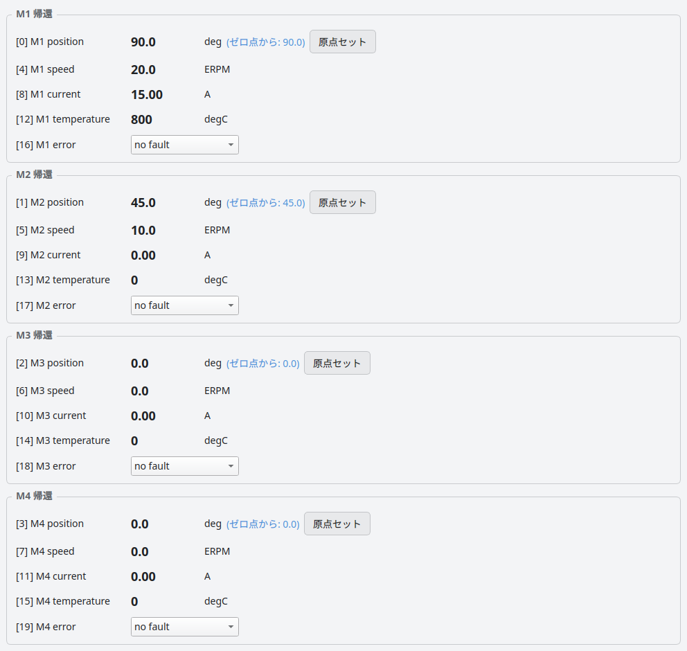

| チャンネル | 種別 | 説明 |
|:---|:---|:---|
| `M{n} position` | 数値表示 | 出力軸角度。0.1deg/LSB。「原点セット」対象（zeroable） |
| `M{n} speed` | 数値表示 | 電気角速度。10ERPM/LSB。出力軸rpmへの換算（極対数・減速比）はモータ機種依存のためGUI側では未実施 |
| `M{n} current` | 数値表示 | 相電流。0.01A/LSB |
| `M{n} temperature` | 数値表示 | モータ温度 [degC] |
| `M{n} error` | 選択式表示 | 故障コード（下表）。デバッグデバイスではGUIから手動設定可能 |

故障コード一覧:

| コード | 意味 |
|:---:|:---|
| 0 | no fault |
| 1 | motor over-temp |
| 2 | over-current |
| 3 | over-voltage |
| 4 | under-voltage |
| 5 | encoder fault |
| 6 | MOSFET over-temp |
| 7 | motor stall |

### 9.4 運用上の注意

- ノード分配側（`MODE_CAN` 等）とCAN速度を1Mbpsに統一済みのため、同一物理バスへの
  混在は可能です（CAN IDが重ならないよう設計されていれば問題ありません）。
- バス帯域を確保するため、ホストからの指令送信は200Hz固定です
  （ファームウェア側 `cubemars.cpp`）。アクチュエータ自身の帰還フレームは
  指令頻度に関係なく自律送信されるため、台数を増やす場合はバス帯域の余裕を
  `firmware/xiao-esp32-s3_can2io/README.md` で確認してください。
- 1バスに接続できるのは最大4台（`config.hpp` の `CUBEMARS_MOTOR_COUNT`）です。

## 10. DJIロボマス（MODE_ROBOMAS）

`robomas_driver` プロファイルは、DJIロボマス（M3508 / M2006 / GM6020 のいずれか）
最大4台を、CANホストのノード分配を介さず直接制御するためのプロファイルです。
モータ機種はファームウェア側 `config.hpp` の `ROBOMAS_MOTOR_TYPE` でコンパイル時に
固定し、1バスには単一機種のみ最大4台接続できます
（スロット割当は `firmware/xiao-esp32-s3_can2io/src/robomas.cpp` を参照）。
接続イメージはCubeMars（[9. CubeMars AKシリーズ](#9-cubemars-akシリーズmode_cubemars)の図）と同様に、
専用CANバス上へ独立デバイスとして最大4台を直接ぶら下げる構成です。

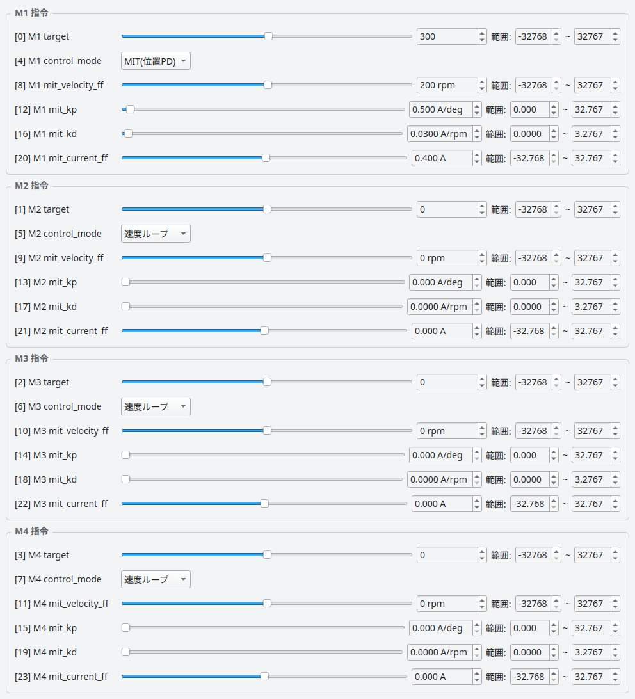

### 10.1 指令チャンネル（Control タブ）

| チャンネル | 種別 | 説明 |
|:---|:---|:---|
| `M{n} target` | 数値 | `control_mode` が速度ループのとき出力軸rpm（ギア比込み、生値スケール無し）。MITのとき目標位置、1deg/LSB、出力軸角度（レンジ±32767=約±91回転） |
| `M{n} control_mode` | 選択式 | `0`=速度ループ（既定） / `1`=MIT(位置PD)。全ゼロ（未接続・E-STOP時の既定）で速度ループ・target=0となり、安全にその場停止する |
| `M{n} mit_velocity_ff` | 数値 | MITモード用の目標速度フィードフォワード（`control_mode=1`のときのみ参照）。1rpm/LSB |
| `M{n} mit_kp` | 数値 | MITモード用の比例ゲイン（`control_mode=1`のときのみ参照）。0.001(A/deg)/LSB |
| `M{n} mit_kd` | 数値 | MITモード用の微分ゲイン（`control_mode=1`のときのみ参照）。0.0001(A/rpm)/LSB |
| `M{n} mit_current_ff` | 数値 | MITモード用の電流フィードフォワード（`control_mode=1`のときのみ参照）。0.001A/LSB |

速度ループの速度PIDゲインはCAN経由では変更できず、ファームウェア側
`config.hpp`（`ROBOMAS_KP_VEL` 等）のコンパイル時定数で固定されています。
一方、MITモードの `mit_kp`/`mit_kd`/`mit_current_ff` はCAN経由で毎周期
変更可能な可変値です。

CubeMarsのMITと対称的な機能ですが、実装の考え方は異なります。ロボマス側の
ESC/GM6020はCANで生の電流指令しか受け付けないため、位置PD制御ループ自体を
マイコン側（`robomas.cpp`）で計算します。位置フィードバックにはロボマス
内蔵のロータエンコーダを使用します（外付けエンコーダのバックラッシュ補正等は
行いません）。

> スケール値はファームウェア側 `config.hpp` の `ROBOMAS_MIT_*` と必ず
> 一致させてください。

### 10.2 帰還チャンネル（Monitor タブ）

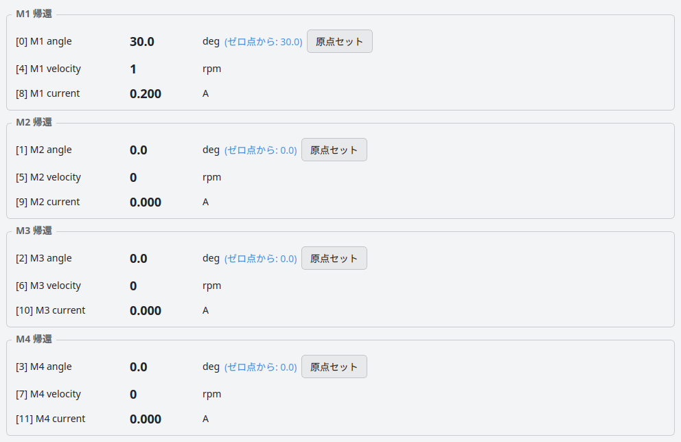

| チャンネル | 種別 | 説明 |
|:---|:---|:---|
| `M{n} angle` | 数値表示 | 出力軸角度。0.1deg/LSB。「原点セット」対象（zeroable） |
| `M{n} velocity` | 数値表示 | 出力軸rpm |
| `M{n} current` | 数値表示 | 相電流。0.001A/LSB |

### 10.3 運用上の注意

- ノード分配側（`MODE_CAN` 等）もCAN速度を1Mbpsに統一済みのため、同一物理バスへの
  混在は可能です（CAN IDが重ならない設計であること）。
- バス帯域を確保するため、指令送信は200Hz固定です（ファームウェア側
  `robomas.cpp`）。台数を増やす場合はバス帯域の余裕を
  `firmware/xiao-esp32-s3_can2io/README.md` で確認してください。

## 11. ファームウェア生成・書き込み

ツールバーの「ファームウェア生成・書き込み…」から、`xiao-esp32-s3_can2io` を
テンプレートに、実機ごとに異なる設定だけを反映したプロジェクト一式を
`generated_firmware/<名前>/` へ生成し、そのまま同じ画面から実機へ書き込め
（`pio run -t upload`）ます。テンプレート自体は書き換えません。

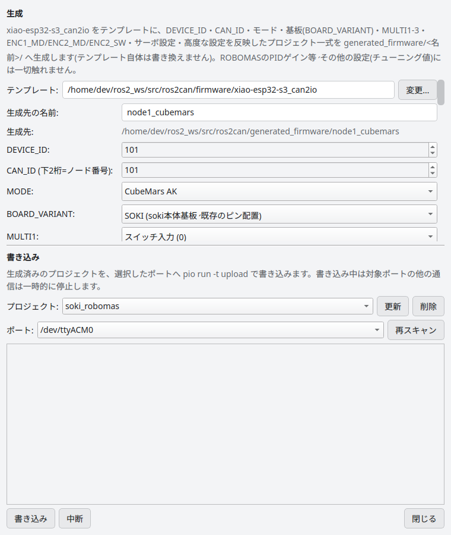

### 11.1 生成できる設定項目

| 項目 | 内容 |
|:---|:---|
| 生成先の名前 | `generated_firmware/<名前>/` としてプロジェクト一式をコピーする際のフォルダ名 |
| DEVICE_ID | serial_bridge互換フレームの `serial_tx_[ID]`/`serial_rx_[ID]` に対応するID |
| CAN_ID（下2桁=ノード番号） | ノードのCAN ID。101〜104のように下2桁がノード番号になるよう設定 |
| MODE | `CAN`(通常のCANノード) / `CAN_HOST`(CANホスト) / `IO`(CAN無し) / `DEBUG` / `CAN_MONITOR` / `ROBOMAS`(DJI RoboMaster) / `CUBEMARS`(CubeMars AK) |
| BOARD_VARIANT | 書き込み先の物理基板。`BOARD_SOKI`(既存のピン配置) / `BOARD_MES`(ENC1/ENC2/MD1/MD2+SW1) / `BOARD_SS`(SERVO1-5+TR1-4) |
| MULTI1〜3 | ピン共有の入出力切替（0=スイッチ入力 / 1=サーボ出力）。BOARD_SOKI系のみ意味を持つ |
| ENC1_MD / ENC2_MD | ピン共有の入出力切替（0=エンコーダ / 1=MD(PWM+DIR)出力） |
| ENC2_SW | BOARD_MES専用。ENC2とSW2/SW3はピン共有のため、どちらで使うかを選択 |
| サーボ設定（SERVO1〜5） | `MIN_US`/`MAX_US`(パルス幅)、`MIN_DEG`/`MAX_DEG`/`INIT_DEG`(角度)をサーボごとに設定。BOARD_SOKIはMULTIn=1(サーボ出力)のチャンネルのみSERVO1-3が有効、BOARD_SSはSERVO1-5が常時有効（SERVO4/5はBOARD_SOKI/BOARD_MESでは未配線） |
| 高度な設定（既定で折りたたみ） | `SERVO_PWM_FREQ`/`SERVO_PWM_RESOLUTION`、`MD_PWM_FREQ`/`MD_PWM_RESOLUTION`、`ENABLE_LED`、`CAN_HOST_DIAG_ENABLE` |

`CAN_NODE_COUNT`/`CAN_SLOTS_PER_NODE` はBOARD_VARIANTごとに `config.hpp` 内で
コンパイル時分岐しているため、このGUIからは編集できません（BOARD_SOKI/BOARD_MES:
4ノード x 5スロット、BOARD_SS: 2ノード x 9スロット）。実際の接続台数に合わせて
変更したい場合は、生成後のプロジェクトの `src/config.hpp` を直接編集してください。
同様に、ROBOMASの速度PIDゲイン等、実測でチューニングされた値もこのGUIの対象外です
（テンプレートの値がそのまま引き継がれます）。

### 11.2 生成の流れ

1. 「テンプレート:」欄に `firmware/xiao-esp32-s3_can2io` が自動検出されます
   （見つからない場合は「変更…」で手動選択）。
2. 各設定項目を入力し、「生成先の名前」を決めます。
3. 「生成」を押すと、テンプレートから `config.hpp` へ反映される変更点の一覧が
   確認ダイアログに表示されます。内容を確認して「はい」を押すと、
   `generated_firmware/<名前>/` へプロジェクト一式がコピーされ、その
   コピー内の `config.hpp` だけが書き換えられます。
4. `generated_firmware/` はGit管理下に置かれ、生成物として履歴に残ります。
   不要になった生成物は、下の「書き込み」欄でプロジェクトを選択して
   「削除」から取り除けます。

### 11.3 書き込みの流れと安全性

1. 下の「書き込み」欄で、生成済みのプロジェクトと書き込み先のポートを選択します。
2. 「書き込み」を押すと確認ダイアログが出ます。承諾すると
   `pio run -t upload` がサブプロセスとして実行され、ログがそのまま
   画面下部に流れます。
3. `ros2can` 自身がシリアルポートを排他専有している（`serial_link.py` の
   `TIOCEXCL`）ため、書き込み開始時に対象ポートの接続を一旦閉じ、書き込み中は
   バックグラウンドのポートスキャナがそのポートに触れないよう一時的に除外します。
   書き込みが完了/中断されると、除外は自動的に解除されます。
4. 書き込みは数十秒かかりうるサブプロセス実行のため、GUIスレッドをブロックしない
   よう別スレッド（QThread）で行われます。「中断」でいつでも打ち切れます。
5. 書き込み中は対象ポートの他の通信（実機からのセンサ受信等）が一時的に
   停止する点に注意してください。

PlatformIO CLI（`pio` コマンド）が必要です。見つからない場合は
`pip install -U platformio` 等でインストールしてください。

## 12. 設定

ツールバーの「設定…」から、ハードウェア直結スキャンの挙動（除外ポート、
タイムアウト、スキャン間隔、device_id ↔ プロファイル対応など）を編集できます。

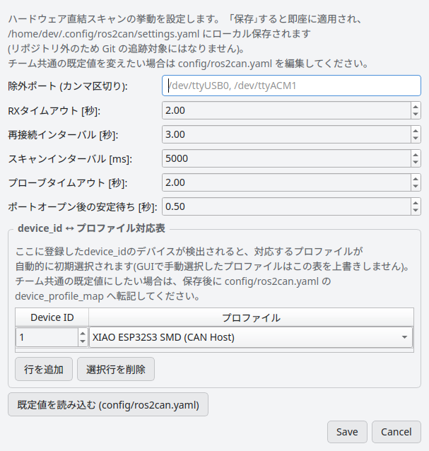

保存すると実行中のスキャナにもその場で反映されます（再起動不要）。設定の優先順位は

1. `config/ros2can.yaml`（このリポジトリのGit管理下、共通の既定値）
2. `~/.config/ros2can/settings.yaml`（GUIの「設定」で保存されるユーザーローカルの上書き。リポジトリの外にあるためGitの追跡対象にはなりません）
3. `--ros-args -p` / launch の `parameters=[...]` で明示的に渡した値

の順です。

## 13. エンコーダ初期化

デバイスごとの Monitor タブにもチャンネル単位の「原点セット」ボタンがありますが、
起動時に複数デバイスをまとめて初期化したい場合は、ツールバーの「エンコーダ初期化…」
から、検出済み全デバイスの zeroable なチャンネル（角度/位置/カウンタ系）を1画面に
まとめて表示し、行単位・デバイス単位・全デバイス一括で原点セットできます。

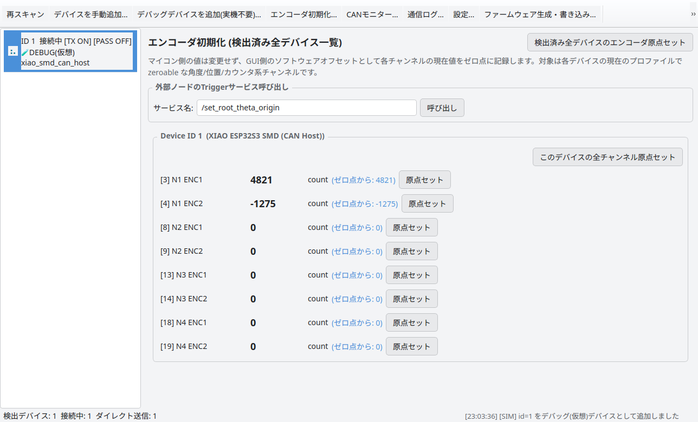

ここでの原点セットはGUI側のソフトウェアオフセットで、マイコン側の値は変更しません
（`serial_rx_[ID]_zeroed` として相対値が配信されます）。実機のエンコーダ自体に
原点を書き込みたい場合は、上部の「外部ノードのTriggerサービス呼び出し」から
対象ノードが提供する `std_srvs/Trigger` サービスを呼び出してください。

## 14. 安全機能について

- 起動直後は全デバイスの「ダイレクト送信」が OFF になっており、実際の指令は
  送信されません。意図した値を設定してから ON にしてください。
- 「トピック通過」は既定 ON で、外部ROSノードからの指令がパネルに反映される
  状態になっています（ダイレクト送信がOFFなら実機へは送られません）。
- ダイレクト送信中は 20Hz で現在の指令値を周期送信し続けます（ウィンドウを
  閉じる、または「全ゼロ送信」/E-STOP を押すと即座にゼロ指令が送信されます）。
- CubeMars/ロボマスの `control_mode` は全ゼロ（未接続・E-STOP時の既定）で
  速度ループ・target=0となるよう設計されているため、位置ジャンプなく安全に
  その場停止します。
- ツールバーの「全デバイス E-STOP」は、接続中の全デバイスへゼロ指令を送信し
  ダイレクト送信を無効化します。緊急時はこれを押してください。
- 外部ノードから接続する場合、ファームウェア側にCAN/シリアル途絶時の
  フェイルセーフは無く、最後に受信した指令を保持し続けます。ノード終了時に
  ゼロ指令を送る後始末は各ノードの責務です（[7.4節](#74-サンプルパッケージ-ros2can_examplec-ビルド実行可能)
  の `send_zero_and_stop()` を参照）。

## 15. About

ツールバー右端の「Info…」から、バージョン情報とGitHubリンクを確認できます。

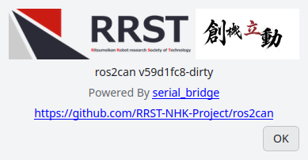

---

<br>
立命館大学 ロボット技術研究会, RRST, NHKプロジェクト（2024–2026）
