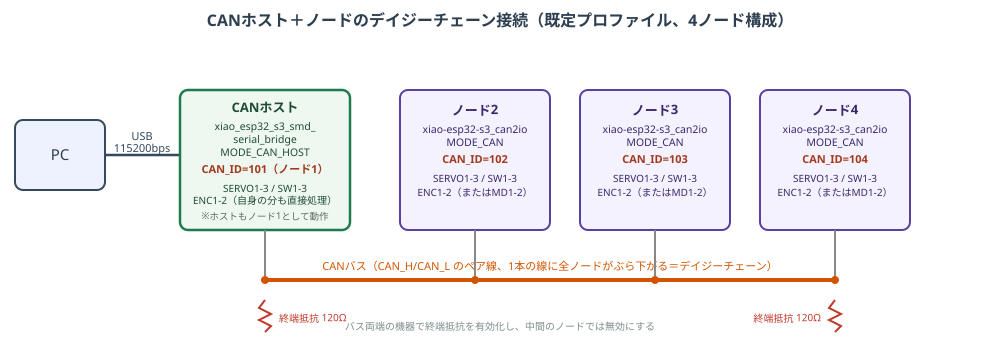
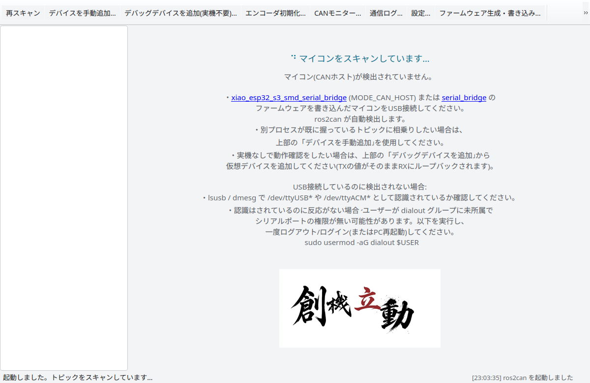
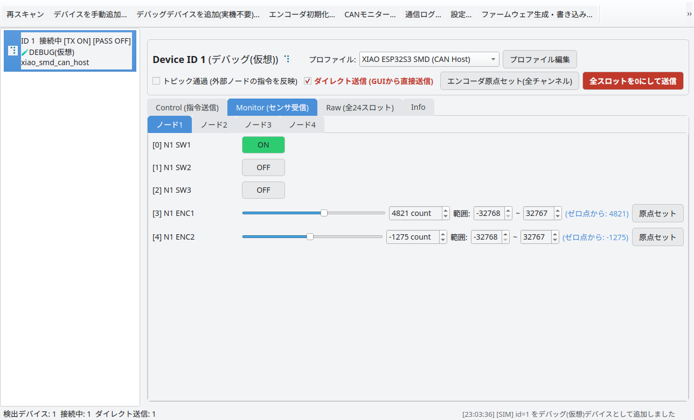
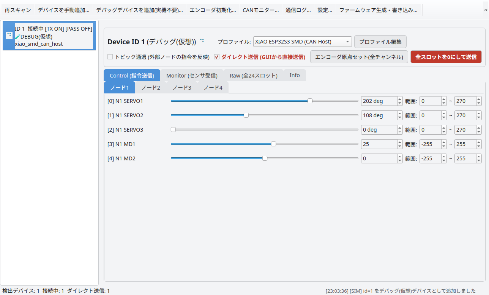
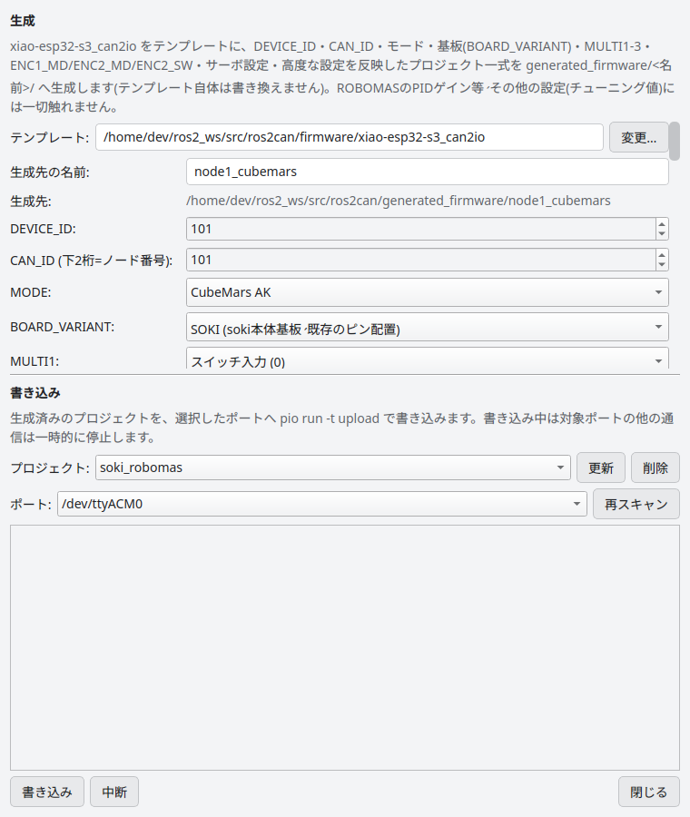
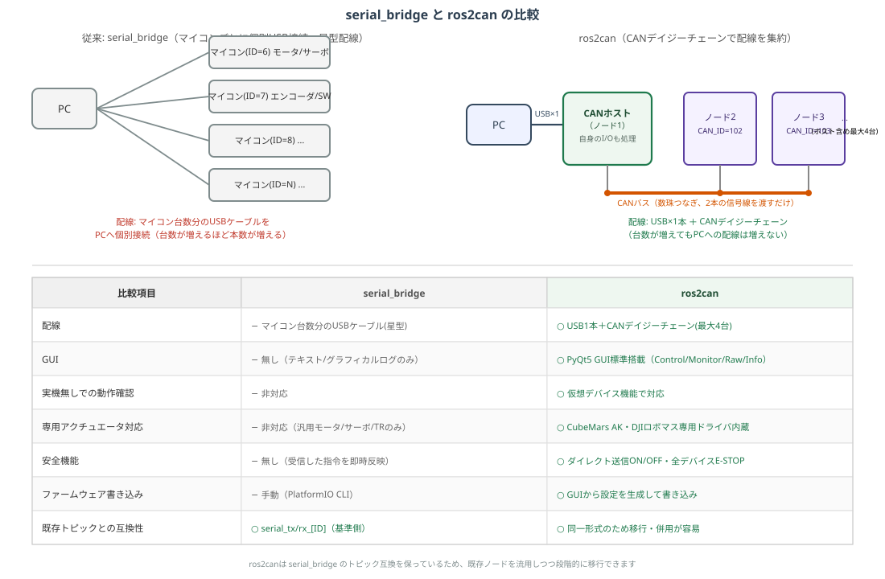

> **ros2can を初めて触る人・serial_bridge から乗り換える人向けのガイドです。**
> 講習資料（PowerPoint）の内容をもとにまとめています。全機能の詳細は [マニュアル](index.md) を見てください。
>
> 講習資料（PowerPoint）: [ros2can 講習](https://github.com/RRST-NHK-Project/ros2can/blob/main/pptx/ros2can%E8%AC%9B%E7%BF%92.pptx) ／
> [serial_bridge から ros2can へ（移行ガイド）](https://github.com/RRST-NHK-Project/ros2can/blob/main/pptx/serial_bridge%E3%81%8B%E3%82%89ros2can%E3%81%B8_%E7%A7%BB%E8%A1%8C%E3%82%AC%E3%82%A4%E3%83%89.pptx) ／
> [serial_bridge 講習](https://github.com/RRST-NHK-Project/serial_bridge/blob/main/pptx/serial_bridge%E8%AC%9B%E7%BF%92.pptx)

## 目次

- [1. ros2canとは](#1-ros2canとは)
- [2. システム構成](#2-システム構成)
- [3. インストールと起動](#3-インストールと起動)
- [4. 実機なしで試す](#4-実機なしで試す)
- [5. 画面の見方](#5-画面の見方)
- [6. 止め方と安全機能](#6-止め方と安全機能)
- [7. 自作ノードから動かす](#7-自作ノードから動かす)
- [8. 応用](#8-応用)
- [9. serial_bridge を使ってきた人へ](#9-serial_bridge-を使ってきた人へ)
- [10. もっと詳しく知りたくなったら](#10-もっと詳しく知りたくなったら)

serial_bridge を使ったことがある人は、先に [9章](#9-serial_bridge-を使ってきた人へ) を読むと違いがつかみやすいです。

---

## 1. ros2canとは

`ros2can` は [serial_bridge](https://github.com/RRST-NHK-Project/serial_bridge) をベースに開発した後継パッケージです。
CANバスでマイコンを**デイジーチェーン接続**し、PyQt5 の GUI から直接操作できます。

| 特徴 | 内容 |
|:---|:---|
| CANデイジーチェーン | PCとはUSB1本。残りのマイコンは電源+CANの4ピンケーブルで数珠つなぎ |
| GUI搭載 | Control / Monitor / Raw / Info の4タブで指令送信とセンサ確認 |
| 実機なしで試せる | 仮想デバイスで画面やトピック連携をその場で確認 |
| ロボマス・CubeMars対応 | DJIロボマス・CubeMars AK を専用モードで直接制御（MITモード等） |
| FW生成・書き込み | マイコンの設定をGUIで入力し、生成から書き込みまで完結 |
| serial_bridge互換 | `serial_tx_[ID]` / `serial_rx_[ID]` はそのまま。既存ノードを流用可能 |

## 2. システム構成



- PCとつながるのは **CANホスト1台だけ**（USB1本、115200bps）。
- ホストの配下に最大3台の子マイコン（`MODE_CAN`）をCANバス（1Mbps）でつなぎます。
  ホスト自身も**ノード1**として自分のI/Oを直接処理するので、1バスで最大4ノードです。
- CANバスの**両端の基板で終端抵抗（120Ω）を有効に**し、中間の基板では無効にします。
- PC⇔ホストは serial_bridge 互換の **24 × int16 フレーム**です。ホストがこの24スロットを
  各ノードへ5スロットずつ分配・集約します（[7.2節](#72-24スロットの割当既定プロファイル)）。

ノード番号はGUIのタブ表記・CAN_IDの下2桁と同じ **1始まり**（ノード1〜4 = CAN_ID 101〜104）です。
コード上のインデックスは0始まり（ノード1 → `0`）なので注意してください。

### ファームウェアのMODE

同じファームウェア `firmware/xiao-esp32-s3_can2io` を、`config.hpp` の MODE を切り替えて使い回します
（MODE は1つだけ定義。複数定義・未定義はビルドエラー）。

| MODE | 役割 |
|:---|:---|
| `MODE_CAN_HOST` | PCとUSB接続し、配下のノードを束ねるCANホスト（自身もノード1） |
| `MODE_CAN` | ホスト配下の汎用IOノード（PCとは直接つながない） |
| `MODE_ROBOMAS` | DJIロボマス最大4台を直接駆動する独立デバイス |
| `MODE_CUBEMARS` | CubeMars AKシリーズ最大4台を直接駆動する独立デバイス |
| `MODE_IO` | CANを使わない、IOのみのスタンドアロン動作 |
| `MODE_CAN_MONITOR` | 生CANフレームをシリアル出力するだけの診断用 |

> **ピン共有に注意**: 基板の MULTI1〜3 は「スイッチ入力 or サーボ出力」、ENC1/ENC2 は
> 「エンコーダ入力 or MD出力（PWM+DIR）」のどちらかで使います。どちらにするかは
> `config.hpp`（`MULTIn` / `ENCn_MD`）でコンパイル時に固定します。実配線と設定が一致しないと動きません。

## 3. インストールと起動

```bash
# 1. 依存パッケージ
sudo apt install python3-pyqt5 python3-serial

# 2. ポート権限（初回のみ・反映には再ログインが必要）
sudo usermod -aG dialout $USER

# 3. ビルド
cd ~/ros2_ws
colcon build --packages-select ros2can
source install/setup.bash

# 4. 起動
ros2 run ros2can ros2can
# config/ros2can.yaml のパラメータを読むなら
ros2 launch ros2can ros2can.launch.py
```

起動するとこういう画面が出ます（実機がまだ何もつながっていない状態）。
ホスト基板をUSBに挿すだけで自動的に検出され、デバイス一覧に表示されます。



## 4. 実機なしで試す

実機が無くても「仮想デバイス」で操作を体験できます。

1. ツールバーの「**デバッグデバイスを追加（実機不要）…**」を押し、DEVICE_ID（例: `1`）を入力する。
   仮想デバイスが一覧に追加されます。
2. **Control** タブでスライダーを動かし、右上の「**ダイレクト送信**」にチェックを入れる。
   このチェックが入るまでは何も送信されません（誤操作防止）。
3. **Monitor / Raw / Info** タブで値を確認する。書いた値が仮想デバイスのRXにループバックされます。
4. Monitor タブではスイッチやエンコーダのカウント値を手入力して、実機のセンサ入力を再現できます。



仮想デバイスも実機と同じく `serial_rx_[ID]` を Publish / `serial_tx_[ID]` を Subscribe するので、
rqt や自作ノードのテストにそのまま使えます。

## 5. 画面の見方



| 場所 | 役割 |
|:---|:---|
| デバイス一覧（左） | 検出したマイコン。右クリックで削除 |
| ツールバー（上） | 再スキャン・デバッグデバイス追加・FW生成・E-STOP など |
| プロファイル | 24スロットの解釈（ノード構成）を選ぶ |
| トピック通過 / ダイレクト送信 | 外部ノードの指令を通すか、GUIの値を送るか |
| 全スロットを0にして送信 | そのデバイスへゼロ指令 |

| タブ | 用途 |
|:---|:---|
| **Control**（指令送信） | サーボ・モータ等へ指令。送信には「ダイレクト送信」ONが必要 |
| **Monitor**（センサ受信） | スイッチ・エンコーダ等をリアルタイム表示。「原点セット」も可 |
| **Raw**（全24スロット） | プロファイルを介さず生の24スロットを直接編集・確認 |
| **Info**（通信状態） | 接続状態・RX周波数・フレーム数。通信トラブルの切り分けに |

## 6. 止め方と安全機能

| 機能 | 内容 |
|:---|:---|
| ダイレクト送信は既定OFF | 起動直後は何も送信されない。値を確認してからONにする |
| **■ 全デバイス E-STOP** | 全デバイスにゼロ指令を送り、送信を無効化。**迷ったらこれ** |
| ウィンドウを閉じる＝ゼロ指令 | 閉じるだけでも安全側に倒れる |
| モード値0で安全停止 | CubeMars / ロボマスは全ゼロで速度ループ・目標0＝その場で停止 |

> **⚠ ファームウェアに通信途絶時のフェイルセーフはありません。**
> CAN・シリアルが途切れても、マイコンは最後に受け取った指令を保持し続けます。
> 自作ノードで動かす場合は、ノード終了時にゼロ指令を送る処理を必ず入れてください（例: `rclcpp::on_shutdown`）。

## 7. 自作ノードから動かす

### 7.1 トピック

| トピック | 型 | 向き | 内容 |
|:---|:---|:---|:---|
| `serial_tx_[ID]` | `Int16MultiArray` | ROS → ホスト | 制御指令（24スロット） |
| `serial_rx_[ID]` | `Int16MultiArray` | ホスト → ROS | センサ値（24スロット、serial_bridge互換） |
| `serial_rx_[ID]_unwrapped` | `Int32MultiArray` | ホスト → ROS | エンコーダのオーバーフローを展開した積算値 |
| `serial_rx_[ID]_zeroed` | `Int32MultiArray` | ホスト → ROS | 「原点セット」時点からの相対値 |
| `zero_channel_request` | `Int32MultiArray` | ROS → ros2can | `[device_id, ch]` で原点セット（`ch<0` で全ch） |

`[ID]` はホストのファームウェアの `DEVICE_ID` です（GUIのデバイス一覧でも確認できます）。

### 7.2 24スロットの割当（既定プロファイル）

24スロットを4ノード × 5スロットに分けています（20〜23は未使用）。

| スロット | 0〜4 | 5〜9 | 10〜14 | 15〜19 |
|:---|:---:|:---:|:---:|:---:|
| ノード | ノード1＝ホスト（101） | ノード2（102） | ノード3（103） | ノード4（104） |

| local | 指令（TX） | 帰還（RX） |
|:---:|:---:|:---:|
| 0 | SERVO1 | SW1 |
| 1 | SERVO2 | SW2 |
| 2 | SERVO3 | SW3 |
| 3 | （予備） | ENC1 |
| 4 | （予備） | ENC2 |

```
index = node × 5 + local    （node はコード上0始まり: ノード1 → 0）
```

自分で数える必要がないように、`common/include/common/Ros2CanPacketController.hpp` が用意されています。

### 7.3 サンプル: サーボを動かす

やることは「publisher」「一定周期の送信」「subscriber」の3つだけです
（完全版: `ros2can_example/src/servo_sweep_example.cpp`）。

```cpp
#include "common/Ros2CanPacketController.hpp"
Ros2CanPacketController pkt;

// 1) 指令をpublish（ID = ホストのDEVICE_ID）
pub_ = create_publisher<Int16MultiArray>("serial_tx_1", 10);

// 2) 一定周期で送り続ける
void timer_callback() {
  pkt.setServo(/*node*/0, /*servo*/1, 90);  // ノード1のSERVO1を90度
  Int16MultiArray msg;  msg.data = pkt.toVector();
  pub_->publish(msg);
}

// 3) センサ値を受け取る
void sensor_callback(const Int16MultiArray::SharedPtr m) {
  pkt.updateRx(m->data);
  bool sw1 = pkt.getSW(0, 1);  int16_t enc1 = pkt.getEnc(0, 1);
}

// 終了時にゼロ指令（ノード側の責務）
rclcpp::on_shutdown([this]{ send_zero_and_stop(); });
```

| メソッド | 内容 |
|:---|:---|
| `setServo(n, k, deg)` | ノード n の SERVOk を角度指令（0〜270にクランプ） |
| `getSW(n, k)` | SWk の状態 |
| `getEnc(n, k)` | ENCk のカウント |
| `updateRx(data)` | 受信値を反映 |
| `toVector()` | 送信用配列を取得 |

CubeMars 用には `Ros2CanCubemarsPacketController.hpp` があります（サンプル: `cubemars_position_example`）。

### 7.4 CLIで疎通確認

```bash
# 受信を眺める
ros2 topic echo /serial_rx_1

# 1回だけ送る（先頭=SERVO1に90）
ros2 topic pub --once /serial_tx_1 std_msgs/msg/Int16MultiArray \
  "{data: [90,0,0,0,0, 0,0,0,0,0, 0,0,0,0,0, 0,0,0,0,0, 0,0,0,0]}"

# デバイス1の全チャンネルを原点セット
ros2 topic pub --once /zero_channel_request std_msgs/msg/Int32MultiArray "{data: [1, -1]}"
```

> **`--once` を忘れずに。** `ros2 topic pub` は既定で周期送信です。忘れると指令が送られ続けます。

### 7.5 外部ノードの指令が届く条件

| トピック通過 | ダイレクト送信 | 実機に届く値 |
|:---:|:---:|:---:|
| ON（既定） | OFF（既定） | 外部ノード |
| ON / OFF | ON | GUIの値 |
| OFF | OFF | 送信されない |

- ダイレクト送信ONのデバイスは `serial_tx_[ID]` を無視します。
- ダイレクト送信中は 20Hz で現在値を周期送信します。
- 実機が無くても「デバイスを手動追加…」でトピックを先に確認できます。

## 8. 応用

### 8.1 CubeMars AKシリーズ（MODE_CUBEMARS）

独立デバイスとしてAKシリーズ最大4台を直接制御します。アクチュエータ内蔵のクローズドループを使うので、ホスト側でPIDは不要です。

| control_mode | モード | target の単位 |
|:---:|:---|:---|
| 0 | 速度ループ | 10 ERPM / LSB |
| 1 | 位置ループ | 0.1 deg / LSB |
| 2 | MIT（Force Control） | 0.1 deg / LSB |

MITモードはモータ側で `torque = Kp·(pos_des − pos) + Kd·(vel_des − vel) + τ_ff` を計算する柔らかい位置制御です。
Kp を下げると外力を受け流す関節に、Kp=0 + τ_ff ならトルク制御になります。**Kp/Kd は小さい値から少しずつ上げてください。**

> **⚠ 角度には上限があります: 出力軸 ±716.2°（±12.5 rad）**
> - AKシリーズ共通のMITプロトコルの固定小数点の限界で、設定では変えられません。
> - 範囲外は無警告でクランプされます（「ある角度から先が動かない」で気づく）。
> - 負荷側の範囲 ＝ ±716.2° ÷ 減速比（13.7:1 なら約 ±52°）。
> - 連続回転する関節は速度ループを使ってください。

詳細: [マニュアル 9章](index.md#9-cubemars-akシリーズmode_cubemars)

### 8.2 DJIロボマス（MODE_ROBOMAS）

M3508 / M2006 / GM6020 のいずれか1機種を最大4台（機種は `config.hpp` の `ROBOMAS_MOTOR_TYPE` で固定）。

| control_mode | モード | 内容 |
|:---:|:---|:---|
| 0（既定） | 速度ループ | target = 出力軸rpm（PIDゲインはFW固定） |
| 1 | MIT（位置PD） | target = 出力軸角度 1deg/LSB |

ロボマスのESCは電流指令しか受け付けないため、位置PDループはマイコン（`robomas.cpp`）で計算します。
指令送信は200Hz固定です。CubeMarsと同じ1Mbpsなので同一バスに混在できます（CAN IDの重複に注意）。

詳細: [マニュアル 10章](index.md#10-djiロボマスmode_robomas)

### 8.3 ファームウェア生成・書き込み

1. ツールバーの「ファームウェア生成・書き込み…」を開く。テンプレート `firmware/xiao-esp32-s3_can2io` が自動検出されます。
2. DEVICE_ID・CAN_ID・MODE・BOARD_VARIANT・MULTI・サーボ範囲などを入力する。
3. 「生成」→ `config.hpp` への変更点を確認 → `generated_firmware/<名前>/` に生成されます（テンプレート自体は書き換えません）。
4. プロジェクトとポートを選んで「書き込み」。`pio run -t upload` が実行されます（ポート専有は自動で一時解除）。

PlatformIO CLI が必要です（`pip install -U platformio`）。



詳細: [マニュアル 11章](index.md#11-ファームウェア生成書き込み)

## 9. serial_bridge を使ってきた人へ

### 9.1 ひとことで言うと

| | serial_bridge | ros2can |
|:---|:---|:---|
| **配線** | マイコンごとにUSBでPCへ | **CANのデイジーチェーンでPCとはUSB1本** |
| **操作** | ターミナルのログ表示のみ | GUIで指令送信・確認・FW書き込み |
| **互換** | `serial_tx_[ID]` / `serial_rx_[ID]` | トピック・フレーム形式はそのまま |

### 9.2 なぜ作ったのか

serial_bridge は学ロボ26で、「無線（UDP）が会場の電波干渉で不安定」という問題を受けて作った有線シリアル通信の仕組みです。
開発者1名・低予算という当時の体制では CAN の開発コストが高いと判断し、シリアル通信 + ESP32 を選びました。
「マイコンにIDを持たせてポート番号に依存しない」「ポートを触るのは仲介ノード1つだけ」という設計は、
そのまま ros2can に引き継がれています。

一方、運用していく中で次の課題が見えてきました。

- **配線が増える**: マイコン1台につきUSB1本。台数が増えるほどケーブルとUSBポートが増える
- **状態が見えにくい**: ターミナルのログのみ。指令送信やパラメータ確認は別ツールが必要
- **専用アクチュエータ**: ロボマス・CubeMars を汎用出力の延長でしか扱えない
- **実機がないと試せない**: マイコンを繋がないと、ノードやトピック連携を確認できない

これらを CAN化とGUI化で解決したのが ros2can です。

### 9.3 最大の目玉: 配線がUSB1本になる



serial_bridge はマイコンの台数分のUSBケーブルとポートが必要な星型配線でした。
ros2can では PC とつながるのはホスト1台分のUSB1本だけで、残りは**電源+CANの4ピンケーブル1本**で次の基板へ数珠つなぎにします。
4基板構成なら **USB 4本 → 1本**。台数が増えてもPC側の配線は増えず、基板を増やすときはデイジーチェーンの末尾に足すだけです。

### 9.4 比較表

| 観点 | serial_bridge | ros2can |
|:---|:---|:---|
| 配線 | マイコン1台＝USB1本の星型 | CANホスト（USB1本）＋CANデイジーチェーン |
| UI | ターミナルのみ（テキスト / ASCIIバー / なし） | PyQt5 GUI（Control / Monitor / Raw / Info） |
| スロットの意味 | FWごとに固定（1〜8 = DCモータ 等） | プロファイルで可変、CANノードへ分配 |
| エンコーダ | 生のパルス値をそのままPublish | オーバーフロー展開・原点セット（`_unwrapped` / `_zeroed`） |
| 実機なしの確認 | なし | 仮想デバイスで確認できる |
| ロボマス / CubeMars | 汎用のロボマスモードのみ | 専用ドライバ（MITモード等） |
| FWの設定 | `config.hpp` を手で編集 | GUIで生成・書き込み |
| ポート専有 | 排他フラグなし | `TIOCEXCL` で排他専有 |
| 実装 | C++（rclcpp） | Python（rclpy + PyQt5） |

### 9.5 そのまま使えるもの

| 項目 | 内容 |
|:---|:---|
| トピック名 | `serial_tx_[ID]` / `serial_rx_[ID]` |
| メッセージ型 | `std_msgs/msg/Int16MultiArray` |
| データ長 | 24 × int16 |
| フレーム形式 | `0xAA`｜ID｜LEN｜DATA｜XOR（115200bps） |
| ID方式 | `DEVICE_ID` で識別（ポート順に非依存） |
| スキャン | 自動スキャン・ホットプラグ・`excluded_ports` |

既存ノードの「publish / subscribe する部分」はほぼそのまま流用できます。変わるのは「どのスロットが何を意味するか」だけです。

### 9.6 注意: スロットの意味が変わる

| スロット | serial_bridge（esp32_serial_bridge の例） | ros2can（既定プロファイル） |
|:---|:---|:---|
| 0 | DEBUG | ノード1: SERVO1 / SW1 |
| 1〜8 | MD1〜8 | ノード1〜2 のスロット |
| 9〜16 | SERVO1〜8 | ノード2〜4 のスロット |
| 17〜23 | TR1〜7 | ノード4 のスロット・未使用（20〜23） |

インデックスを直書きしているコードは要修正です。例えば serial_bridge の `data[9]` は SERVO1 ですが、
ros2can ではノード2の予備スロット（受信では ENC2）です。
`PacketController` → `Ros2CanPacketController` に置き換えて、ライブラリにインデックスを計算させてください。

### 9.7 コードの移行例

**serial_bridge**

```cpp
#include "common/PacketController.hpp"
PacketController pkt;

pub_ = create_publisher<Int16MultiArray>("serial_tx_3", 10);

pkt.setServo(SERVO2, 90);
msg.data = pkt.toVector();

// 受信: インデックスを直接読む
int16_t enc1 = m->data[1];
bool    sw1  = m->data[9];
```

**ros2can**

```cpp
#include "common/Ros2CanPacketController.hpp"
Ros2CanPacketController pkt;

pub_ = create_publisher<Int16MultiArray>("serial_tx_1", 10);   // 同じ

pkt.setServo(/*node*/0, 2, 90);  // ノード番号が増える
msg.data = pkt.toVector();       // 同じ

// 受信: ラッパー経由
pkt.updateRx(m->data);
int16_t enc1 = pkt.getEnc(0, 1);
bool    sw1  = pkt.getSW(0, 1);
```

PS4コントローラでの操作例は `cr26_soki/src/ros2can_practice.cpp` を参照してください。

### 9.8 移行の手順

1. **ros2can をビルドして起動**（[3章](#3-インストールと起動)）
2. **仮想デバイスで既存ノードを確認** — 「デバッグデバイスを追加」→ 自作ノードの publish / subscribe を確認
3. **ノードのスロット処理を書き換え** — `PacketController` → `Ros2CanPacketController`（インデックス直書きを解消）
4. **FWを生成して基板に書き込む** — ホストは `MODE_CAN_HOST`、子は `MODE_CAN`。CAN_ID は 101〜104
5. **配線してテスト** — USBはホストだけ。バス両端の終端抵抗を確認 → ダイレクト送信OFFのまま疎通確認

### 9.9 移行期間中の併用

同じPCで serial_bridge と ros2can を併用できます。ros2can はポートを開いた直後に `TIOCEXCL` で排他専有するので、
ros2can が先に掴めば serial_bridge 側は open に失敗してリトライするだけです。ただし逆（serial_bridge が先）は防げません。
お互いに相手が管理するポートを `excluded_ports` で除外しておいてください。

```yaml
# config/ros2can.yaml
excluded_ports: ["/dev/ttyUSB0", "/dev/ttyUSB1"]   # serial_bridge が使うポート

# config/serial_bridge.yaml
excluded_ports: ["/dev/ttyACM0"]                   # ros2can が使うポート
```

### 9.10 移行時に気をつけること

| 項目 | 内容 |
|:---|:---|
| **⚠ フェイルセーフはFWに無い** | 通信が途切れてもマイコンは最後の指令を保持。終了時のゼロ指令（`on_shutdown`）は必須 |
| ダイレクト送信とトピック通過 | ダイレクト送信ONのデバイスは外部ノードの `serial_tx_[ID]` を無視する |
| ピン共有の設定 | `MULTIn`（サーボ/SW）・`ENCn_MD`（ENC/MD）は `config.hpp` で固定。実配線と一致させる |
| 終端抵抗とCAN_ID | バスの両端に120Ω。CAN_ID（101〜104、下2桁＝ノード番号）を重複させない |
| DCモータの数 | 既定プロファイル（SOKI基板）はDCモータ非搭載。MDが必要なら `ENCn_MD=1` か MES基板 |

新規の機体では ros2can の採用を強く推奨します。

## 10. もっと詳しく知りたくなったら

| やりたいこと | 参照先 |
|:---|:---|
| 画面・設定の詳細を知りたい | [6. 画面構成](index.md#6-画面構成) / [12. 設定](index.md#12-設定) |
| 外部ノード・サンプルの詳細 | [7. 外部ノードとの接続](index.md#7-外部ノードとの接続) |
| プロファイル・スロット割当の詳細 | [8. プロファイル](index.md#8-プロファイル) |
| CubeMars / ロボマスの全チャンネル | [9. CubeMars](index.md#9-cubemars-akシリーズmode_cubemars) / [10. ロボマス](index.md#10-djiロボマスmode_robomas) |
| エンコーダの原点をまとめてリセット | [13. エンコーダ初期化](index.md#13-エンコーダ初期化) |
| 内部の処理・プロトコルの詳細 | [技術マニュアル（内部実装編）](internals.md) |
| 講習資料（PowerPoint） | [ros2can 講習](https://github.com/RRST-NHK-Project/ros2can/blob/main/pptx/ros2can%E8%AC%9B%E7%BF%92.pptx) / [移行ガイド](https://github.com/RRST-NHK-Project/ros2can/blob/main/pptx/serial_bridge%E3%81%8B%E3%82%89ros2can%E3%81%B8_%E7%A7%BB%E8%A1%8C%E3%82%AC%E3%82%A4%E3%83%89.pptx) / [serial_bridge 講習](https://github.com/RRST-NHK-Project/serial_bridge/blob/main/pptx/serial_bridge%E8%AC%9B%E7%BF%92.pptx) |

---

[← 本編マニュアルに戻る](index.md)
